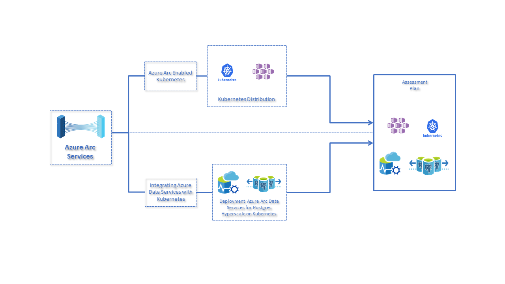
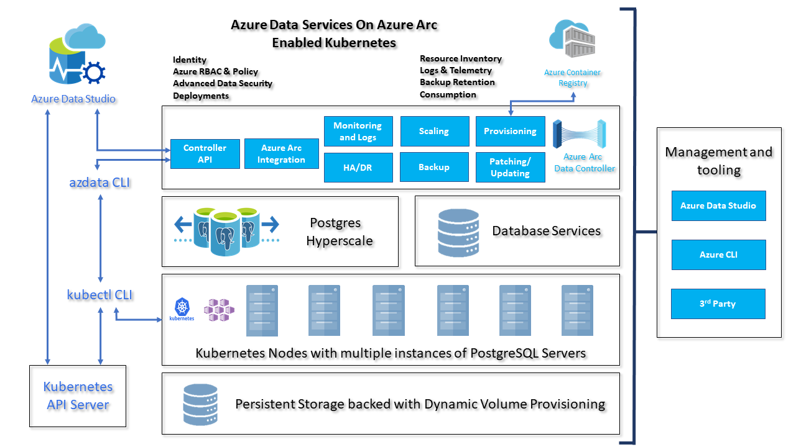

# Azure Arc enabled data services 

## Prerequisite

Note: You need at least one Standard_D8s_v3 (8 vCPU's 32 RAM GiB) and premium disks supported worker nodes to achieve the scenario.

## Scenario

## Azure Data Controller and PostgreSQL Hyperscale installation with required tools.

1. [Installation of Client Tools](docs/001-install-client-tools.md) (azdata, kubectl, Azure CLI, Azure Data Studio (Insiders))
2. [Create Data Controller](docs/002-create-data-controller.md)
3. [Deployment of Postgres Hyperscale on Azure Arc](docs/003-create-pghsaa-instance.md)
4. [Load test data on Azure Database for PostgreSQL Hyperscale server group](docs/004-load-test-data.md)
5. [Scale out Azure Database for PostgreSQL Hyperscale server group](docs/005-scale-out-pghsaa.md)
6. [Uninstalling steps](docs/006-uninstall-azure-arc.md)

## Overall Architecture Diagram

